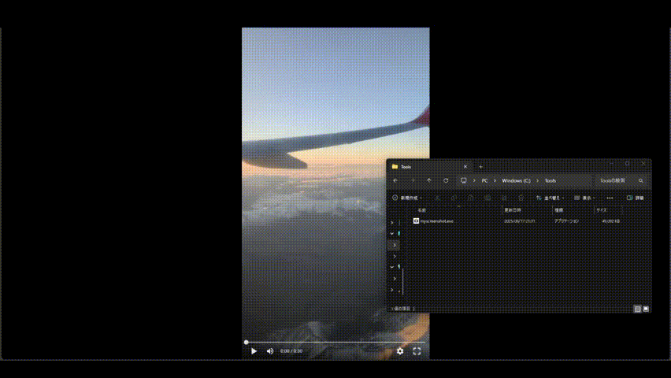

# My Screenshot Tool
定期的かつ期間を指定して、スクリーンショットを取得して保存するツールを開発しました。exe は (2025/06/17 時点で) 公開しませんが、作成できるようにはしています。

## 注意事項
- コードは Gemini と相談しながら書きました。
- Windows 11 でのみ動作確認しました
- 開発環境
  - Ubuntu 24.04.2 LTS
  - Docker version 28.2.2, build e6534b4
  - Docker Compose version v2.36.2
  - Go 1.24.4

## ツール作成
### アイコン画像の作成
`.svg` から `.ico` への変換には ImageMagick を用い、`.ico` から `.syso` の変換には [GitHub: akavel / rsrc](https://github.com/akavel/rsrc) を用いました。

```
$ sudo apt install imagemagick
$ convert camera.svg -define icon:auto-resize=48,32,16 camera.ico
$ wget https://github.com/akavel/rsrc/releases/download/v0.10.2/rsrc_linux_amd64
$ chmod +x rsrc_linux_amd64
$ ./rsrc_linux_amd64 -ico camera.ico -o ../camera.syso
```

### コンパイル
Docker をインストールしたホストで以下コマンドを実行するとコンパイル可能です (数分かかります)。

```
$ docker compose up --build go-builder
```

## デモ
GUI で保存先、キャプチャ間隔、取得時間、キャプチャするウィンドウを設定すると、保存先に指定したフォルダにスクリーンショットが保存されます。


